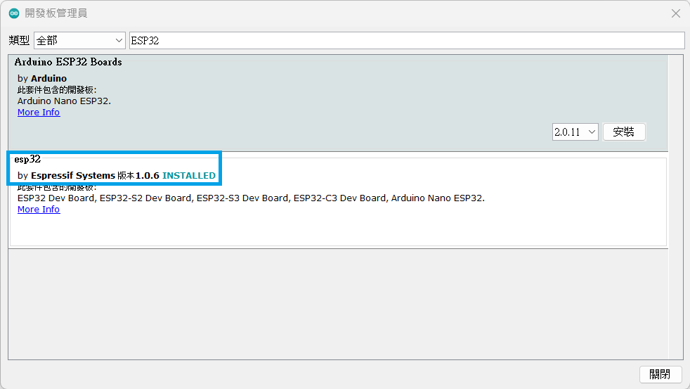
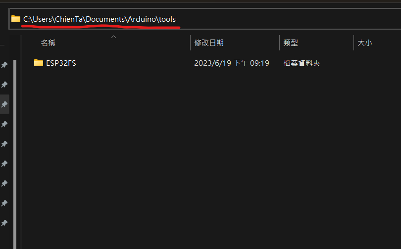
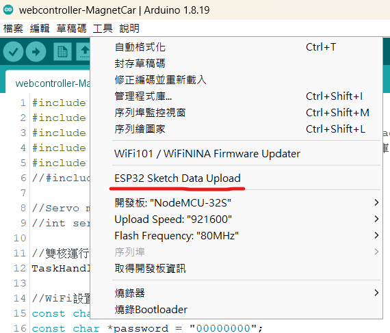

# 磁吸車控制程式碼
注意：這個Code僅能用於Arduino 1.8.19版

## 環境安裝說明
Step 1: 下載 [Arduino 1.8.19](https://www.arduino.cc/en/software) 版並安裝 
Step 2: 選擇 `檔案` > `偏好設定` > `額外的開發版管理員網址` 填入： 
<pre><code>https://espressif.github.io/arduino-esp32/package_esp32_index.json</code></pre>

Step 3: 選擇 `工具` > `開發版` > `開發版管理員`，搜尋ESP32 
Step 4: 安裝 esp32 1.0.6 版 (By ESPressif Systems)

Step 5: 選擇 `草稿碼` > `匯入程式庫` > `加入.zip程式庫`，匯入 `env-package` 中的兩個檔案
- AsyncTCP-master.zip
- ESPAsyncWebServer-master.zip

Step 6: 將 `env-package` 中的 `ESP32FS-1.1.zip` 解壓縮，並將解壓縮後的檔案整個複製到 `C:\Users\[使用者名稱]\Documents\Arduino\tools` 底下

Step 7: 重新啟動 Arduino IDE，確認 `工具` 是否出現 `ESP32 Sketch Data Upload` 選項

## 網頁修改
請修改 `data` 中的文件實現網頁介面以及功能變更
- index.html → 修改網頁介面
- script.js  → 修改 javascript 功能(基於 jquery)

如有任何修改，請存檔後點擊 `ESP32 Sketch Data Upload` 上傳至磁吸車的 ESP32 中